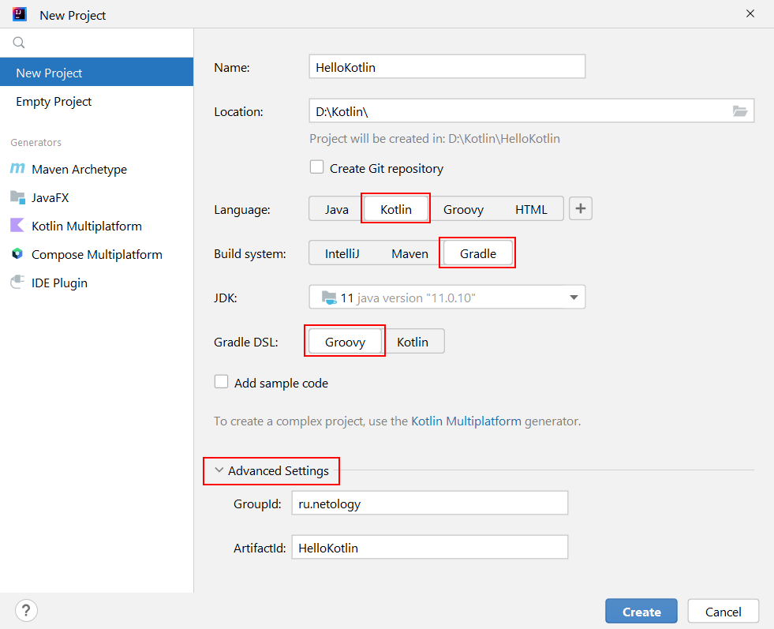
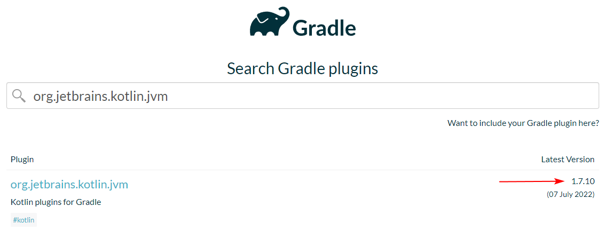

## Задача №1. First App

Cоздайте проект, выводящий в консоль `First App!`.

При этом:
* groupId: ru.netology;
* artifactId: first-app;
* version: 1.0-SNAPSHOT.

При создании проекта используйте следующие настройки:

В `build.gradle` поставьте самую последнюю стабильную (не `RC`, не `alpha` и не `beta`) версию плагина `org.jetbrains.kotlin.jvm`, доступную на https://plugins.gradle.org:

Итог: у вас должен быть репозиторий на GitHub, в котором будет ваш Gradle-проект.